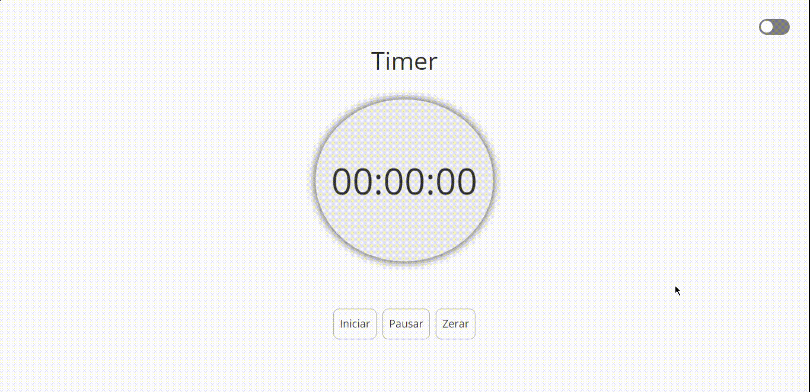

# Timer
Um Timer simples, com manipulação de DOM usando JavaScript e funções callback como setInterval.

## Features

- Light/dark mode toggle
- Live previews
- Fullscreen mode

  

## 🛠 Skills
Javascript, HTML, CSS..

## 🔗 Links

